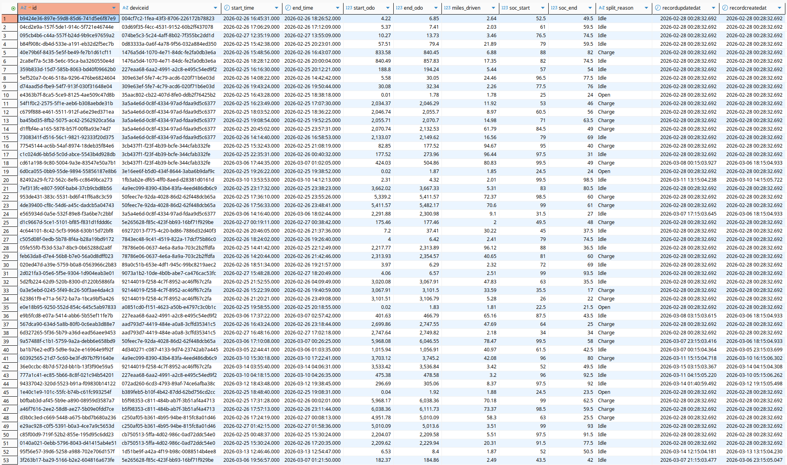
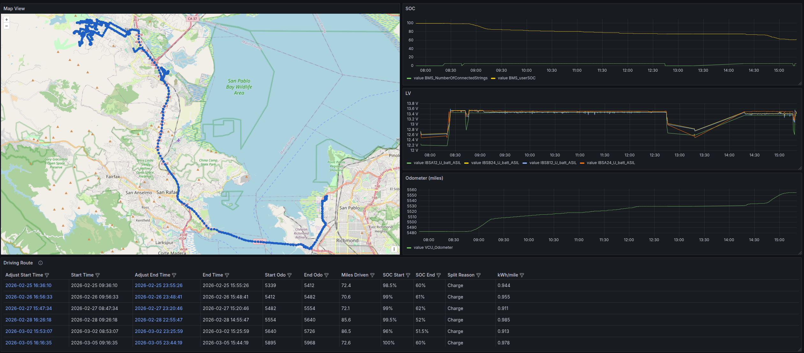

## Executive Summary

The Harbinger Route Calculator processes millions of rows of synchronized CAN bus telemetry to generate deterministic, consolidated driving routes for the fleet. 

In its latest iteration, the calculation engine underwent a massive architectural refactor to eliminate Python-level memory allocation overhead and database query bottlenecks. By leveraging **C-level Pandas vectorization**, lightweight iteration, and bulk PostgreSQL upserts, processing time for a standard 180-truck batch dropped from **~48 seconds to ~0.7 seconds**—a **64× performance improvement**.

---

## 1. Performance Optimization: Overcoming the Python Bottleneck

### The Original Bottleneck: `iterrows()` and Scalar Math
The initial engine processed telemetry sequentially using Pandas `iterrows()`. Because Python is dynamically typed, iterating row-by-row forces the interpreter to perform type checks, allocate memory for a full Pandas Series object, and dispatch mathematical operations sequentially for every single row. Across 500,000+ rows of telemetry, this CPU thrashing caused severe latency.

### The Solution: Vectorization and `itertuples()`
To achieve sub-second processing, the engine was rewritten to utilize **vectorization**. 

Instead of computing time gaps and distance deltas inside a Python loop, these operations are now applied to entire columns simultaneously. This pushes the heavy mathematical lifting down to highly optimized C/C++ execution paths at the hardware level.

Once the math is calculated in bulk, the engine iterates over the data using `itertuples()`, which yields lightweight, read-only NamedTuples with near-zero overhead.

#### Vectorized Math Implementation
```python
# --- Vectorization (The Math) ---
# Executed in bulk via C-level paths before iteration begins
df['odo_mi'] = df['odometer'] * METERS_TO_MILES
df['time_gap'] = df['time'].diff().dt.total_seconds().fillna(0.0)

if 'prnd_state' not in df.columns:
    df['prnd_state'] = 0  # Default to 0 if column is missing

# --- Lightweight Iteration ---
for row in df.itertuples():
    # Dot-notation access avoids dictionary-style lookups
    t = row.time
    odo_mi = row.odo_mi
    soc = row.soc
    charge_st = row.charge_state
    prnd_st = row.prnd_state
    time_gap = row.time_gap
    # ... logic continues ...
```

---

## 2. Core Route Engine Logic

The engine must intelligently parse continuous streams of telemetry to determine when a route begins and, more importantly, *why* it ends. 

A route actively starts when the vehicle registers its first odometer increase (`> 0.01 miles`) while the vehicle is not in Park (`prnd_state != 1`). 

### The Split Triggers
The engine determines the end of a route based on three primary operational states:

1. **Charge:** The route naturally ends because the truck was plugged in. To prevent signal noise from triggering false stops, this state requires `charge_state == 8` for $k \ge 15$ consecutive records (the noise filter).
2. **Idle:** The route ends because the truck parked and stopped moving. Triggered when a time gap of $\ge 2.5$ hours occurs between valid telemetry rows.
3. **Open:** The truck was still actively driving when the 48-hour data query window cut off. This route is saved to the database but flagged as unfinished, awaiting the next batch run.

---

## 3. Fault Tolerance: The Sliding Window & Reconciliation

Because the engine processes data in 48-hour batches, a truck may be actively driving precisely when the time window cuts off resulting in an **"Open"** route. To prevent duplicating this trip when the next batch runs, the engine employs a highly fault-tolerant overlap reconciliation strategy.

### Deterministic UUIDs
Primary keys for routes are generated dynamically using a namespace hash of the `deviceid` and the exact `start_time`.

### Window Reconciliation Logic
Before finalizing the calculated routes, the engine queries the PostgreSQL database for any historical routes that overlap with the current processing window. 

If a newly calculated route overlaps with an existing database route (especially an "Open" one), the engine **inherits** the original start time and start odometer from the database. 

```python
# --- WINDOW RECONCILIATION ---
final_routes = []
for r in raw_routes:
    calc_start = pd.to_datetime(r['start_time']).tz_localize(None)
    calc_end = pd.to_datetime(r['end_time']).tz_localize(None)
    
    matched_db_route = None
    
    # Check against overlapping routes pulled from the database
    if existing_routes:
        for db_r in existing_routes:
            db_start = pd.to_datetime(db_r['start_time']).tz_localize(None)
            db_end = pd.to_datetime(db_r['end_time']).tz_localize(None) if pd.notnull(db_r.get('end_time')) else pd.Timestamp.max
            
            if calc_start <= db_end and calc_end >= db_start:
                matched_db_route = db_r
                break 
    
    if matched_db_route:
        # INHERIT FROM DATABASE to prevent duplicates
        r['start_time'] = pd.to_datetime(matched_db_route['start_time'])
        r['start_odo'] = matched_db_route['start_odo']
        r['soc_start'] = matched_db_route.get('soc_start', r['soc_start'])

    r['miles_driven'] = r['end_odo'] - r['start_odo']
    r['id'] = generate_uuid(r['deviceid'], r['start_time'])

    if r['split_reason'] == 'Open' or r['miles_driven'] >= min_miles:
        final_routes.append(r)
```

### PostgreSQL UPSERT Integrity
Because the UUID is strictly deterministic, writing the reconciled route to the database triggers an `ON CONFLICT` clause. Instead of failing or duplicating, PostgreSQL seamlessly updates the `end_time`, `end_odo`, and `split_reason` of the original route.

```sql
INSERT INTO driving_route (
    id, deviceid, start_time, end_time, 
    start_odo, end_odo, miles_driven, 
    soc_start, soc_end, split_reason
)
VALUES (
    :id, :deviceid, :start_time, :end_time, 
    :start_odo, :end_odo, :miles_driven, 
    :soc_start, :soc_end, :split_reason
)
ON CONFLICT (id)
DO UPDATE SET
    end_time = EXCLUDED.end_time,
    start_odo = EXCLUDED.start_odo,
    end_odo = EXCLUDED.end_odo,
    miles_driven = EXCLUDED.miles_driven,
    soc_end = EXCLUDED.soc_end,
    split_reason = EXCLUDED.split_reason,
    recordupdatedat = NOW();
```

---

## 4. Visualizing Fleet Operations

The raw data calculated by the engine provides the foundation for fleet analytics, range estimation, and operational monitoring. 

### Raw Route Telemetry (Database View)
Below is a sample of the consolidated data stored in the `driving_route` table, representing the fully reconciled trips.



### Fleet Route Dashboard (Grafana)
By parsing the deterministic route records, we can visualize active vehicle states, historic trips, and charging behaviors across the entire fleet in near-real-time.

